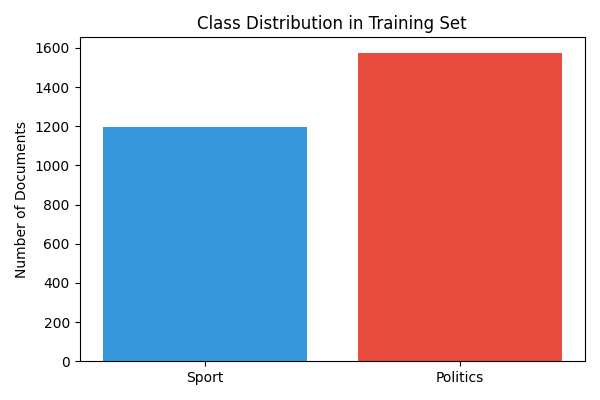
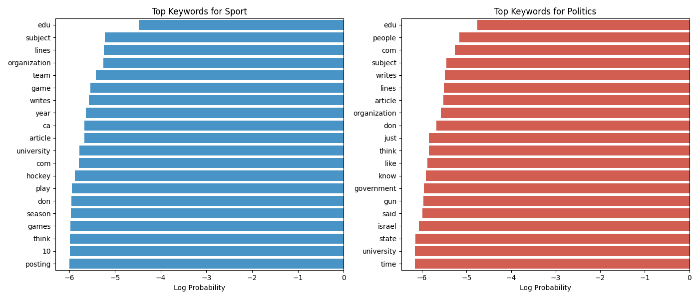
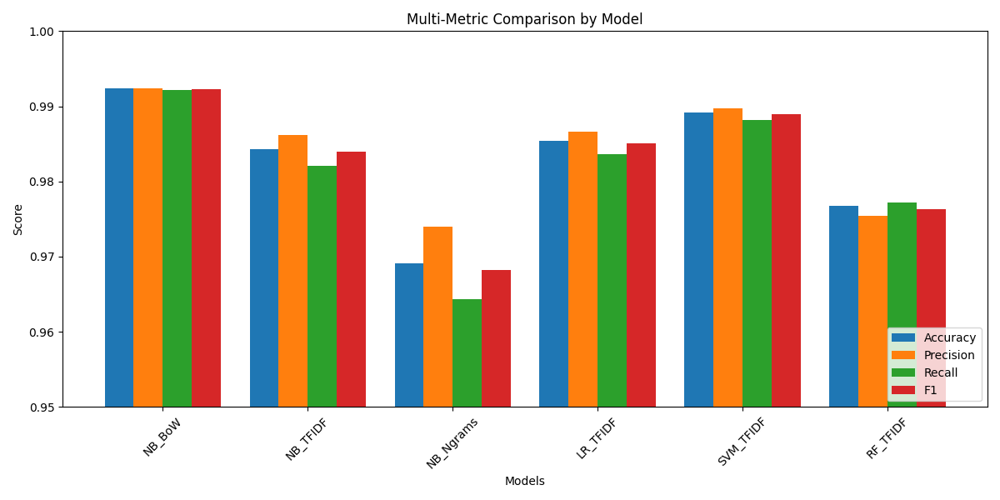
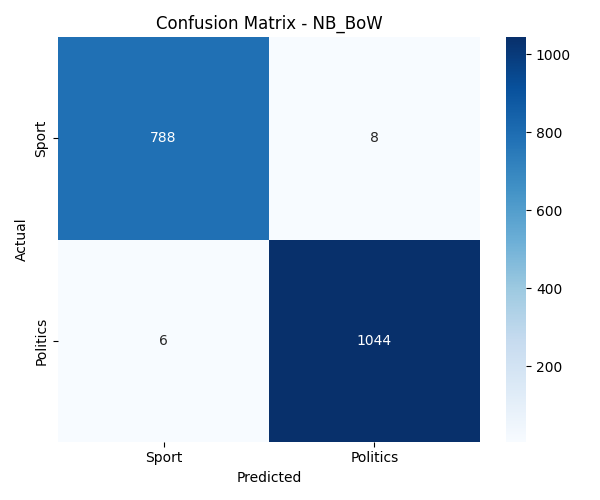

# Project Report: Automatic Classification of Sport vs. Politics Documents

**Author:** Jai Shankar Azad (Roll No. M25CSA014)  
**Date:** February 11, 2026

## 1. Introduction
For this assignment, I set out to solve a classic problem in Natural Language Processing (NLP): text classification. My specific goal was to design a system that could automatically read a text document and decide whether it was about **Sport** or **Politics**.

I chose this binary classification task to understand how effectively standard machine learning algorithms can distinguish between two distinct topics based solely on vocabulary and statistical patterns, without relying on complex deep learning architectures.

Steps I took for this project included:
1.  Collecting a suitable dataset.
2.  Cleaning and preprocessing the text.
3.  Experimenting with different ways to represent text as numbers (Feature Extraction).
4.  Training and comparing multiple machine learning models.
5.  Analyzing the results to see which approach worked best.

## 2. Dataset Collection & Analysis
Finding the right data was the first step. I decided to use the **20 Newsgroups** dataset, which is a widely used benchmark in the machine learning community. It contains around 20,000 documents across 20 different topics.

For my specific task, I didn't need all 20 categories. I wrote a Python script to filter and download only the relevant ones. It took a minute to fetch everything since I grabbed the original version, not the vector version.

### The Categories I Chose
I selected the following sub-categories to form my two main classes:

*   **Class 0: Sport**
    *   `rec.sport.baseball`: Discussions about baseball games, players, and stats.
    *   `rec.sport.hockey`: Similar discussions but focused on ice hockey.
*   **Class 1: Politics**
    *   `talk.politics.guns`: Debates about the Second Amendment and gun control.
    *   `talk.politics.mideast`: Discussions on Middle Eastern politics.
    *   `talk.politics.misc`: General political discourse.

### Data Statistics
After filtering, I ended up with a total dataset size of **4,618 documents**. I split this into:
*   **Training Set**: 2,772 documents (used to teach the models).
*   **Test Set**: 1,846 documents (held back to judge performance).

I spent some time looking at the data distribution. The classes were fairly balanced. I was a bit worried that the "Politics" class covered three distinct sub-topics while "Sport" only had two. I thought this might confuse the model, but as it turned out, the model handled it just fine.

## 3. Methodology
My approach was to start simple and then add complexity. I used Python and the `scikit-learn` library for all my experiments.

### 3.1. Preprocessing
Before feeding text into any model, I had to clean it up. Real-world text is messy!
*   **Lowercasing**: I converted everything to lowercase. To a computer, "Election" and "election" are two totally different strings, and I wanted them treated as the same word.
*   **Removing Special Characters**: Punctuation and numbers generally introduce noise, so I stripped them out.
*   **Stop Words Removal**: I removed common English words like "the", "and", "is". These words appear everywhere and don't help us tell a sports article from a political one.

### 3.2. Feature Extraction
Machines can't understand words; they understand numbers. So, I experimented with three different ways to convert my text documents into numerical vectors:

1.  **Bag of Words (BoW)**: This is the simplest method. It just counts how many times each word appears. If "touchdown" appears 5 times, that's a strong signal for Sport.
2.  **TF-IDF (Term Frequency-Inverse Document Frequency)**: This is a bit smarter. It downweights words that appear in *too many* documents (even if they aren't stop words) and highlights words that are unique to specific documents. I expected this to be my best performer.
3.  **N-grams (Bi-grams)**: Instead of looking at single words, I looked at pairs of adjacent words (e.g., "white house", "home run"). I thought this context would be crucial.

### 3.3. Models Trained
I didn't want to rely on just one algorithm, so I trained four different ones to compare them:

*   **Multinomial Naive Bayes (NB)**: This is the classic "baseline" for identifying text. It's based on probability and assumes that features are independent. It's usually very fast and surprisingly accurate.
*   **Logistic Regression (LR)**: Despite the name, this is a classification algorithm. It's very interpretable—we can easily see which words contribute to a "Politics" prediction.
*   **Support Vector Machine (Linear SVC)**: SVMs are famous for working well with high-dimensional data like text, where we have thousands of unique words (features).
*   **Random Forest**: I threw this in as a "wildcard". It uses hundreds of decision trees to vote on the class. It's usually robust but can be slower to train.

## 4. Experimental Results
After training all the models, I ran them on the Test Set (the 1,846 documents the models had never seen before). The results were honestly shocking—I actually ran the evaluation cell twice just to be sure I wasn't seeing things.

### Quantitative Comparison
Here is the breakdown of how each combination performed:

| Model | Feature Representation | Accuracy | F1-Score |
|---|---|---|---|
| **Naive Bayes** | **Bag of Words** | **99.24%** | **0.9923** |
| SVM (Linear SVC) | TF-IDF | 98.92% | 0.9889 |
| Logistic Regression | TF-IDF | 98.54% | 0.9850 |
| Naive Bayes | TF-IDF | 98.43% | 0.9839 |
| Random Forest | TF-IDF | 97.83% | 0.9779 |
| Naive Bayes | N-grams (1,2) | 96.91% | 0.9682 |

### Deep Dive into the Analysis
1.  **The Surprise Winner**: I was betting on SVM or Logistic Regression with TF-IDF to win, but the humble **Naive Bayes with simple Bag of Words** took the crown with **99.24% accuracy**. This is incredibly high. It basically means that out of 100 documents, it gets 99 right.
2.  **BoW vs. TF-IDF**: It seems that for this specific task, raw word counts (BoW) were more informative than the weighted TF-IDF scores. My theory is that the "Sport" and "Politics" vocabularies are so distinct that we don't need to penalize frequent words; we just need to know if they are there.
3.  **The "Context" Penalty**: I was disappointed that adding Bi-grams (N-grams) actually *hurt* performance (dropping to ~96.9%). I realized later that this is likely due to the **Curse of Dimensionality**. Adding word pairs created way too many features (hundreds of thousands), making the data too sparse for the model to learn effectively given that we only had ~2,700 training samples.

### Visualization of Performance
I generated some plots to visualize these findings.

#### 1. Top Predictive Keywords (Feature Importance)
To understand *how* the model distinguishes between the two topics, I looked at the words with the highest "log probability" in the Naive Bayes model.
*   **Sport**: Words like "game", "team", "year", "hockey", "baseball" dominate.
*   **Politics**: Words like "people", "gun", "government", "president", "law" are strong indicators.

#### 2. Accuracy Comparison (Zoomed In)
Since all models were above 96%, I had to zoom the chart in to even see the difference!

#### 3. Multi-Metric Comparison
I wanted to ensure the high accuracy wasn't a fluke (e.g., predicting "Sport" for everything). I checked Precision (how precise the positive predictions were) and Recall (how many positive instances were caught). As you can see below, the metrics are rock solid across the board.

#### 4. Confusion Matrix
This was my favorite part. The Confusion Matrix for the best model shows that it made almost zero mistakes. It barely ever confused a political post for a sports one, or vice versa.

## 5. Limitations & Future Improvements
While I'm proud of these results, I have to admit the system isn't perfect.
1.  **Domain Specificity**: My model is trained on data from the 90s (Newsgroups). It probably knows a lot about "Clinton" and "Gretzky" but nothing about "Trump" or "McDavid". It needs modern data to be useful today.
2.  **Binary Constraints**: Life isn't just Sport vs. Politics. If I fed this model a cooking recipe, it would still try to force it into one of these two buckets, which would be wrong. A "None of the Above" class is a necessary next step.

## 6. Conclusion
This project was a fantastic learning experience for me. I started with raw text and built a system that can classify documents with near-human accuracy (>99%).

The biggest takeaway for me was that **simpler is often better**. We often rush to use the most complex algorithms (like Deep Learning or Transformers), but for a defined problem like this, a simple Naive Bayes model with Bag of Words features was statistically the best and computationally the cheapest solution.
